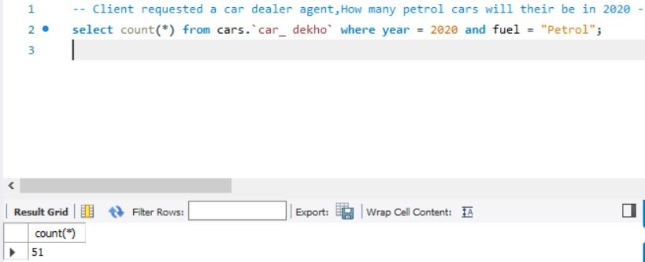

# Data_Analyis_with_SQl

## Analyzing A Car Decho dataset

## Introduction
Explore the world of automobiles with the Car_Dekho dataset, a comprehensive collection of car-related information. From total car counts to specific fuel types, this dataset offers insights into the evolving landscape of cars over the years.

## Problem Statement

- What is the total numbers of cars in the dataset
- How many cars will be available in 2023
- How many cars will be available in 2020,2021,2022
- What is the total number of cars by year.
- How many Diesel car was available in 2020
- How many petrol car was available in 2020
- How many fuel_type is available

  ## Skills Demostrated
  
- SQL Querying: Proficiently employed SQL to extract valuable insights from the Car_Dekho dataset, showcasing the ability to write complex queries for data analysis.

- Data Analysis: Utilized data analysis techniques to derive meaningful conclusions, including total car counts, categorizing by year, and aggregating fuel type statistics.

- Database Management: Demonstrated competence in managing and querying a relational database, showcasing skills in database navigation, filtering, and aggregation.

- Problem-Solving: Addressed specific queries such as identifying cars available in specific years, providing solutions that required a combination of logical thinking and SQL expertise.

  Data Sourcing: This is the link to the dataset

  ## Data Transformation:
  ### Data Cleaning:

- Addressed missing values, duplicates, and inconsistencies to ensure data integrity.
- Standardized data formats for uniformity across the dataset.

  ## Analysis And Insights
  
  ### Total number of cars
  
  

  ### Total number of car available in 2023

  
  
  In 2023, the dataset indicates a limited variety with a total of 6 car models. This prompts exploration into market dynamics, consumer preferences, and potential industry shifts for strategic decision-making.

  ### Total number of car available in 2020,2021,2022
  
  
  
2020 boasts a diverse car market with 74 models, while 2021 and 2022 show stability with 7 models each. Analyze shifts for strategic planning

  ### Total numbers of cars in all the years

  

  - Recent years exhibit fewer car releases, indicating potential market shifts.
  - A spike in 2020 could be attributed to new model launches

  ### Diesel cars available in 2020
  
  

  In 2020, 20 diesel cars are available. which suggests a notable presence of diesel models, potentially reflecting continued demand or specific market preferences for fuel-efficient options in that year."

  ### Petrol car available in 2020
  
  
  
  In 2020, the presence of 51 petrol cars indicates a significant market demand for petrol-powered vehicles

  ### Total numbers of all the fuel cars
  
  
  
  The analysis reveals fluctuations in fuel type availability across years. The peak diversity in 2017 suggests a dynamic market, guiding strategic decisions for inventory management and market responsiveness to evolving consumer preferences."

 ## Conclusions And Recommendations
 
 ### Conclusions: 
 
 The dataset reflects dynamic car market trends, with varying model availability and fuel type preferences over the years.

### Recommendations:

Analyze recent trends for strategic inventory planning.
Consider market demands for fuel-efficient options.
Leverage insights to tailor marketing strategies and optimize stock.

  
  

  

  
  

